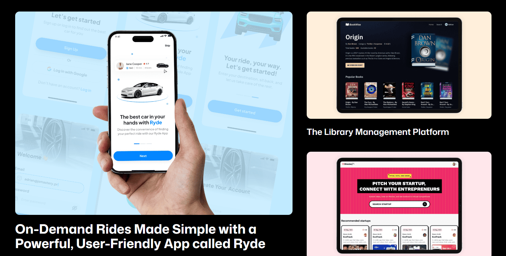
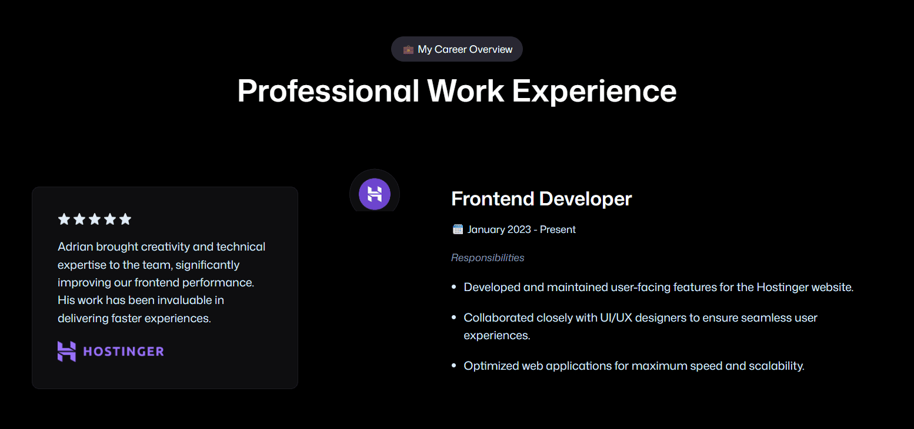
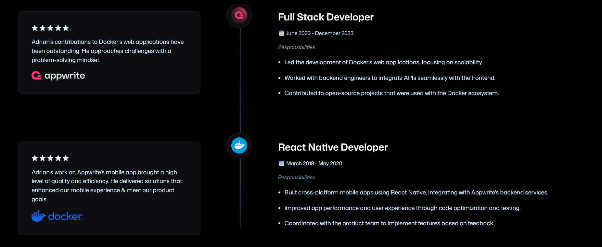

# Interactive 3D Web Portfolio built with React, Three.js, and GSAP

This repository contains the source code for a unique and interactive 3D web developer portfolio. The project is built using modern web technologies to showcase your skills in a visually stunning and engaging way.

---

## Live Demo

[3D Web Developer Portfolio](https://developerthierry.vercel.app/)
_Check out the live version to see the portfolio in action!_

---

## Features

* **Interactive 3D Experience:** A fully-responsive 3D scene serves as the main background, built with Three.js.
* **Smooth Animations:** Utilizes GSAP for fluid, high-performance animations and transitions.
* **Cross-Platform Compatibility:** The portfolio is optimized for both desktop and mobile devices.
* **Modular & Reusable Components:** Built with React, making the code easy to manage and extend.
* **Project Showcase:** Dedicated sections to highlight your projects with detailed descriptions and links.
* **Contact Form:** A functional contact form for visitors to get in touch.

---

## Demo Images

Here are some example images of the sample portfolio's different views to give a better idea of the design and functionality.








---

## Technologies

* **React:** A JavaScript library for building user interfaces.
* **Three.js:** A powerful 3D library for creating and animating 3D scenes in the browser.
* **GSAP (GreenSock Animation Platform):** A professional-grade JavaScript animation library for creating high-performance animations.
* **Tailwind CSS:** A utility-first CSS framework for rapid UI development.
* **Vite:** A fast build tool for modern web development.
* **React Three Fiber:** A React renderer for Three.js.

---

## Getting Started

Follow these steps to get a local copy of the project up and running.

### Prerequisites

You need to have Node.js and npm installed on your machine.

* **Node.js**: [https://nodejs.org/](https://nodejs.org/)

### Installation

1.  **Clone the repository:**
    ```bash
    git clone [https://github.com/DeveloperThierry/3D-Web-Developer-Portfolio.git](https://github.com/DeveloperThierry/3D-Web-Developer-Portfolio.git)
    cd 3D-Web-Developer-Portfolio
    ```
2.  **Install dependencies:**
    ```bash
    npm install
    ```
3.  **Run the development server:**
    ```bash
    npm run dev
    ```
    This will start the development server and open the app in your browser at `http://localhost:5173`.

---

## Deployment

You can easily deploy this project to platforms like Vercel or Netlify.

### Vercel

1.  Create a new project on Vercel.
2.  Import your Git repository.
3.  Vercel will automatically detect that it's a Vite + React project and configure the build settings.
4.  Click "Deploy".

---

## Acknowledgements

* **JSMaster:** For the project inspiration and tutorial.
* **Three.js Community:** For providing an incredible library and resources.
* **GSAP Team:** For their fantastic animation library.